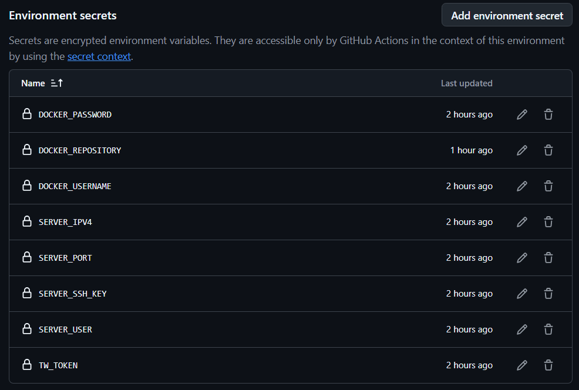
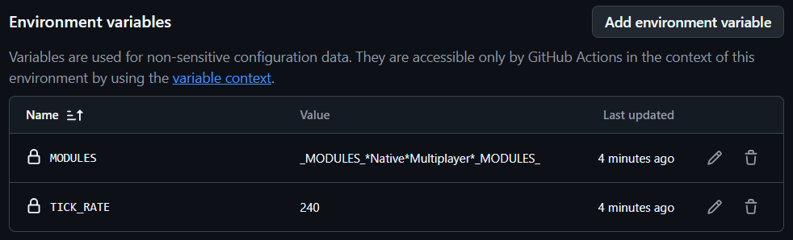

# ☀ TSSL Bannerlord Server
TSSL is a dockerized Bannerlord server setup that allows you to quickly deploy a dedicated server. This guide provides instructions for setting up the server manually, as well as automating the build and deployment process using GitHub Actions and Docker.

---

## 🚀 Get Started

#### 📥 Install Docker
 Docker is a platform for creating, deploying, and managing lightweight, portable containers for applications. It simplifies development by packaging code and dependencies into isolated environments that work seamlessly across different systems.

Installation Links:
- [Linux Debian](https://docs.docker.com/engine/install/debian/)
- [Windows](https://docs.docker.com/desktop/setup/install/windows-install/) 

#### 🔧 Build Docker Image
`docker build -t tssl_bl_srv .`

#### 🚀 Run Docker Image
```
    docker run -d --name your_server_container_name \
    - e TW_TOKEN="Your Taleworld Server Token" \
    - e MODULES="_MODULES_*Native*Multiplayer*_MODULES_" \
    - e TICK_RATE=60 \
    - p 7210:7210/tcp
    - p 7210:7210/udp
    tssl_bl_srv
```

- **Container name**

Replace `--name your_server_container_name` with desired container name for your server.

- **TW_TOKEN** 

For more informations about Taleworld Token, please check out [Taleworld - Hosting a Custom Server](https://moddocs.bannerlord.com/multiplayer/hosting_server/)

- **MODULES**

If you want to enable your custom module, use MODULES enviornment variable `-e MODULES="_MODULES_*Native*Multiplayer*<<Your_Module_Here>>*_MODULES_`

In order to import your module - you just need to add your module into `modules/` directory. Dockerfile will copy all files from `modules/` into `bl_srv/Modules/` inside a container. 

- **TICK_RATE**

A higher tickrate means more updates per second for the clients connected to your server, but may also increase resource usage. The default tickrate is 60 - but you can go as long as 240 from MB: Bannerlord version 1.2.

#### Note: 

We recommend to use [Github Actions](https://docs.github.com/en/actions) to streamline the process of building images for to [Docker Hub](https://hub.docker.com) these images can be deployed to a remote server. 

In order to enable workflow, it is required to setup secrets. To find more informations visit 
`🔐 Github Stored Secrets` section.

---

## 🚀 Worfklows
### [📦 Build Image to Docker Hub](https://github.com/vojinpavlovic/tssl/actions/workflows/deploy.yml)
Builds the latest Docker image from the [dockerfile](https://github.com/vojinpavlovic/tssl/blob/main/dockerfile) and pushes it to Docker Hub

#### 🪶 Arguments

1. ✍️ **♻️ Enviornment Configuration Key**
    - 🏷️ `Type:` string
    - ✔️ `Required:` true
    - ✏️ `Default Value:` none (must be existing)
    - 📙 `Description:` Github Enviornment repository name for deployment  
2. ✍️ **Docker Image Version**
    - 🏷️ `Type:` string
    - ✔️ `Required:` true
    - ✏️ `Default Value:` latest
    - 📙 `Description:` Uploading new build to the Docker Image Version e.g `stable` (production ready) version instead of `latest` (experimental)


### [🚀 Deploy to Remote Server](https://github.com/vojinpavlovic/tssl/actions/workflows/deploy.yml)
Deploys a container on the Training Server (remote server) using the latest image from Docker Hub.

#### 🪶 Arguments

1. ✍️ **♻️ Enviornment Configuration Key**
    - 🏷️ `Type:` string
    - ✔️ `Required:` true
    - ✏️ `Default Value:` none (must be existing)
    - 📙 `Description:` Github Enviornment repository name for deployment  
2. ✍️ **Docker Image Version**
    - 🏷️ `Type:` string
    - ✔️ `Required:` true
    - ✏️ `Default Value:` latest
    - 📙 `Description:` Version you previously build e.g `stable` (production ready) version instead of `latest` (experimental)

### [🕹️ Instance actions on Remote Server](https://github.com/vojinpavlovic/tssl_bl_srv/actions/workflows/instance-actions.yml)
Run an action upon server container using SSH and Docker. The available actions are START,RESTART,STOP,DELETE in workflow.

#### 🪶 Arguments

1. ✍️ **♻️ Enviornment Configuration Key**
    - 🏷️ `Type:` string
    - ✔️ `Required:` true
    - ✏️ `Default Value:` none (must be existing)
    - 📙 `Description:` Github Enviornment repository name for deployment  
2. ✍️ **🎬 Remote Server Action for Server Instance**
    - 🏷️ `Type:` choice
    - ✔️ `Required:` true
    - ✏️ `Default Value:` START
    - ☰  `Options`: 
        - START
        - RESTART
        - STOP
        - DELETE
    - 📙 `Description:` Choose an action to run upon Remote Server using Docker

---

## 🔐 Github Stored Secrets

Secrets are managed by [Environments for deployment](https://docs.github.com/en/actions/managing-workflow-runs-and-deployments/managing-deployments/managing-environments-for-deployment) on GitHub.



- **DOCKER_USERNAME**: `Account Username from Docker Hub.`
- **DOCKER_PASSWORD**: `Account Password from Docker Hub.`
- **DOCKER_REPOSITORY**: `Repository from Docker Hub for Bannerlord Server`
- **SERVER_IPV4**: `Server IP address for deployment`
- **SERVER_USER**: `The server user for deployments with docker execute permissions`
- **SERVER_SSH_KEY**: `The user SSH key for server access`
- **SERVER_PORT**: `Exposed Container port to the Public`
- **TW_TOKEN**: `Generated Taleworld Server Token using Server Commands`

Beside secrets we have configurable variables called Enviornment variables.



- **TICK_RATE**: `A higher tickrate means more updates per second for the clients`
- **MODULES**: `If you want to enable your custom module, use MODULES enviornment variable, it only includes Multiplayer by default, but can be overriden using MODULES enviornment variable in deployment workflow`.

## 🧾 License

This project is licensed under the **MIT** License. 

See the [LICENSE](https://github.com/vojinpavlovic/tssl/blob/main/LICENSE) file for more details.
